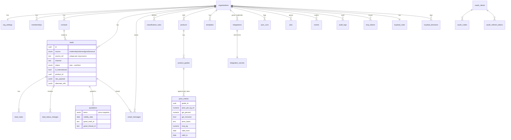

# Architecture

## Layers

```
 Browser (Next.js App Router pages, server actions)      Claude (claude.ai / Code / Cowork)      Supabase pg_cron
            │                                                     │ MCP over HTTPS                       │ every 10 min
            ▼                                                     ▼                                      ▼
   src/app/(app)/**/actions.ts                        src/app/api/mcp/route.ts                 src/app/api/cron/tick
            │                                          (OAuth 2.1 / bearer auth)               (x-cron-secret)
            └──────────────┬──────────────────────────────────────┴──────────────────────────────────────┘
                           ▼
            SERVICE LAYER  src/modules/<module>/service.ts
            defineService(): zod input → permission → one transaction → audit row + domain events
                           │
                           ▼
            Postgres (Supabase, schema `app`, RLS on every table) ◄── humans run as role `authenticated`
                           ▲                                          system/MCP run as owner, org-scoped
            External APIs: Gmail REST (read + drafts), TradeIndia inquiry API
```

**Every action goes through the service layer.** The web UI, the MCP tools and the cron jobs all call the same functions, and permissions, validation, audit and events happen only there. ESLint enforces the boundaries:
- UI code can't import `@/db` or any schema.
- A module can't import another module's `schema`.

## Folder layout

```
src/
  app/                    Next.js routes
    (app)/                signed-in pages: dashboard, leads, review, rates, templates, indiamart, settings
    api/mcp               MCP endpoint;  api/oauth/{register,token}; api/well-known/* (rewritten from /.well-known)
    api/cron/tick         background sync entry point
    api/integrations/gmail/callback   Google OAuth redirect
    oauth/authorize       MCP OAuth consent screen
    login, auth/*         Supabase Auth screens
  components/             UI (shadcn-style primitives in components/ui)
  db/                     Drizzle client, withUserTx (RLS) / withSystemTx
  lib/                    env, errors, crypto (AES-GCM), phone (E.164), format (₹, IST), auth, rate limit
  modules/<name>/         schema.ts · service.ts · types.ts · *.test.ts
  server/seed.ts          idempotent seed (org, owner, catalog, rates, templates, rules)
  proxy.ts                session refresh + sign-in redirect (Next 16's middleware)
drizzle/                  SQL migrations (never edit an applied one)
fixtures/emails/          anonymised email samples with expected parse results
seed/                     rates.json, products.json (from the rates file + stdmfood.com)
scripts/                  local DB, migrations (TCP or Management API), seed, demo data, keys
tests/, e2e/              Vitest integration tests; Playwright smoke tests
```

## Modules

| Module | Owns | Key service functions |
|---|---|---|
| `core` | organizations, org_settings, memberships, audit_logs, events, jobs, integrations, integration_secrets, sync_runs | org settings, integration state and encrypted secrets, backoff, sync runs, job queue, audit reads |
| `contacts` | contacts | `resolveContactInternal` (email → phone dedupe, fill-only) |
| `leads` | leads, lead_notes, lead_status_changes | `upsertLeadInternal` (idempotent + 48h merge), list/get, status, notes, edit, manual lead |
| `email` | email_messages, classification_rules | parsers + `classifyEmail`, `ingestMessageInternal`, review queue, `submitEmailClassification`, rules, reconciliation |
| `sources` | (no tables) | Gmail client, OAuth and sync; TradeIndia client, normaliser and sync; job registry `jobs.ts` |
| `catalog` | products, product_grades, price_entries | current rates (DISTINCT ON), `updateRates` (append-only), history, `matchProduct` |
| `templates` | templates | placeholder engine, defaults, save with validation |
| `quotes` | quotations | `createQuoteDraft` (snapshot → MIME → Gmail draft in thread), WhatsApp text |
| `mcp` | mcp_tokens, oauth_clients, oauth_codes, oauth_refresh_tokens | tokens, OAuth AS, MCP server + tools |
| `buyleads` | buylead_rules, buylead_decisions | rules (full + compact), log decision (cap enforced), summary |
| `dashboard` | (no tables) | one-shot dashboard data |

**Common columns** (brief §6.3): every table has `id uuid`, `created_at`, `updated_at` (trigger), `created_by` (actor string `human:<uuid>` / `mcp:<token>` / `system:<job>`), and `org_id`. `deleted_at` exists where soft delete makes sense.

Two tables are exceptions:
- `organizations` — the org itself.
- `oauth_clients` — registered before an org is chosen.

## Data model



## Lead lifecycle and sources

```
TradeIndia API ──(normalize)──┐
Gmail: TradeIndia email ──────┤ parsers → NormalizedLead → upsertLeadInternal ─► lead (status new)
Gmail: IndiaMART email ───────┤                              │ dedupe: source+source_ref, then phone/email+product ±48h
Gmail: direct inquiry ─► needs_review ─► Claude (MCP) or a person ─► submitEmailClassification ─┘
Manual (phone) ─► createManualLead
```

Every source implements the same three steps: **fetch → normalize to `NormalizedLead` → upsert** (`src/modules/sources/types.ts`). The raw payload is stored so it can be reprocessed later.

## Background jobs

| Job type | What it does | Scheduling |
|---|---|---|
| `gmail.sync` | historyId incremental sync. Falls back to a date resync if the historyId has expired. At most 150 messages per run; the rest wait in a backlog. | enqueued by every tick, and right after connect |
| `tradeindia.sync` | 30-day backfill on first run, then (last success − 2d) → now in 7-day windows | every tick, and after a successful Test connection |

`/api/cron/tick`:
1. Enqueues both job types for each org. `dedupe_key` keeps at most one queued job per org per type.
2. Claims due jobs with `SKIP LOCKED`.
3. Runs them. Failures retry with backoff; after 5 attempts the job is `failed`.
4. Integration errors also set `integrations.backoff_until`, and the dashboard shows the last error.

## MCP tool catalogue

Endpoint: `POST /api/mcp`. It's stateless Streamable HTTP, and every call needs a Bearer token (OAuth or manual). Responses are compact JSON. Email content is wrapped as `<<<UNTRUSTED_EMAIL id=…>>> … <<<END_UNTRUSTED_EMAIL>>>`.

| Tool | Input | Returns | Writes |
|---|---|---|---|
| `list_leads_needing_action` | `limit?, cursor?` | new and stale open leads (compact), `next_cursor` | — |
| `get_lead` | `lead_id` | lead, notes, history, last 5 emails (untrusted), quotes | — |
| `update_lead_status` | `lead_id, status, reason?` | new status | status + audit + event |
| `add_lead_note` | `lead_id, note` | note id | note + audit + event |
| `list_emails_needing_review` | `limit?, cursor?` | emails (untrusted bodies), hints, parsed fields | — |
| `submit_email_classification` | `email_id, classification, confidence, reason, lead?, lead_id?` | status, lead id | classification. `inquiry`/`international` create a lead; `low` confidence stays in review |
| `get_current_rates` | `query?` | `[{product, grade, grade_id, inr_kg, gst, basis, moq_kg, pack, since}]` | — |
| `create_quote_draft` | `lead_id, grade_ids?, validity_days?` | quote id, status, Gmail draft URL | quotation + Gmail **draft** |
| `get_classification_rules` | — | active rules | — |
| `get_buylead_rules` | — | test mode, cap, remaining, product terms, exclusions, locations, qty range | — |
| `log_buylead_decision` | `lead_title, product?, location?, quantity?, decision, reason, timestamp?` | remaining today | decision row |
| `get_buylead_summary` | — | today's counts and remaining cap | — |

MCP tokens **cannot**:
- delete anything
- change rates, templates, rules or settings
- read credentials
- send email
- export in bulk

See `MCP_PERMISSIONS` in `src/modules/core/permissions.ts`.

## How to extend

### Add a module
1. Create `src/modules/<name>/{schema,service,types}.ts`. Tables go in `app` via `app.table(...)` with `...baseColumns()` and `orgId`.
2. Export the schema from `src/db/schema.ts` and add the module name to `MODULES` in `eslint.config.mjs`.
3. Run `npm run db:generate`, then create a **custom** migration (`npx drizzle-kit generate --custom --name <x>_rls`). It must enable RLS and add policies with `app.is_member` / `app.has_role`, like `drizzle/0001_rls_policies.sql`. Extend `tests/rls.test.ts`.
4. Write services with `defineService`, adding a new permission in `core/permissions.ts` if needed. Call `audit()` and `emit()` in every write.
   - A service that reads or writes a system-only table (`integration_secrets`) needs `runAs: "system"`. The `authenticated` role can never read those tables, so without it the call fails for every signed-in user. Scope every query by `ctx.orgId`.
   - A service that calls an external API (Google, TradeIndia) uses `defineExternalService` and opens short `withSystemTx` transactions itself, so no database connection is held during the network call.
   - Add the new function to `docs/CODEMAP.md`, and test it as a signed-in role in `tests/human-paths.test.ts` (that runs under RLS like the real app).

### Add a lead source (e.g. Justdial, website form)
1. Implement a client and `normalize(raw) → NormalizedLead` in `src/modules/sources/<source>/`, with a unique `sourceRef`.
2. Add a `sync<Source>(ctx)` function modelled on `syncTradeIndia`. It should record a sync run, handle errors and backoff, and call `upsertLeadInternal`.
3. Register the job type in `src/modules/sources/jobs.ts` and enqueue it from `tick()`.
4. If the source also sends notification emails, add a parser in `src/modules/email/parsers/` plus anonymised fixtures in `fixtures/emails/` with `expected` blocks. The fixture test picks them up automatically.
5. Add the enum value to `lead_source` in a new migration (`ALTER TYPE app.lead_source ADD VALUE '…'`).

### Add an export format (roadmap: GST invoice CSV, proforma)
Put formatters in a new `exports` module: `format(quotation | order) → { filename, mime, body }`, one per format, all behind one service `exportDocument(ctx, {kind, id, format})` with permission `exports.run` and an audit row. Formatters are pure functions (easy to unit test). Subscribe to `quote.drafted` or future `order.*` events if generation should be automatic.

### React to events
`events` is an outbox. A future worker reads rows with `processed_at is null` by `type` (e.g. `lead.created` → follow-up reminder), does its work, and sets `processed_at`. Add the handler to `JOB_HANDLERS` and schedule it from `tick()`.
